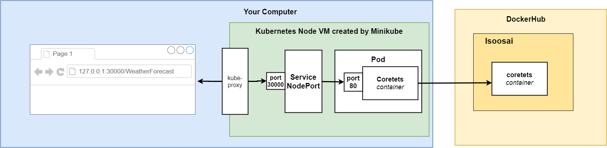
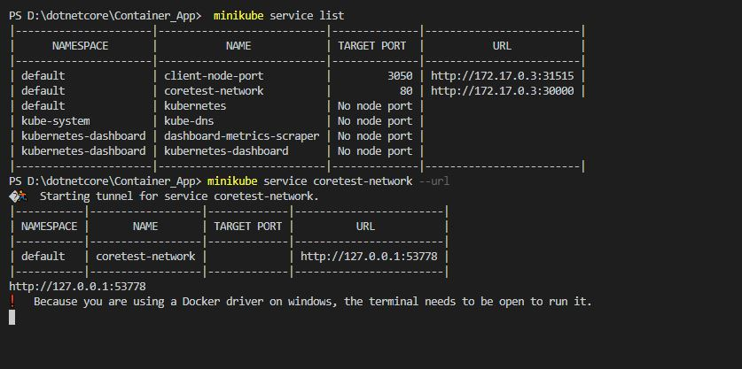
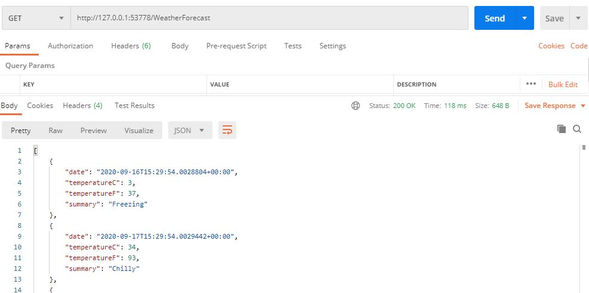

# NodePort [Testing purpose - Only DEV]
Exposes a container to the outside through kubeproxy

## high level architecture 


## create kubernetees container 
```docker
kubectl apply -f .\k8s\NodePort
```
## expose service outside


## Verify using  Postman


