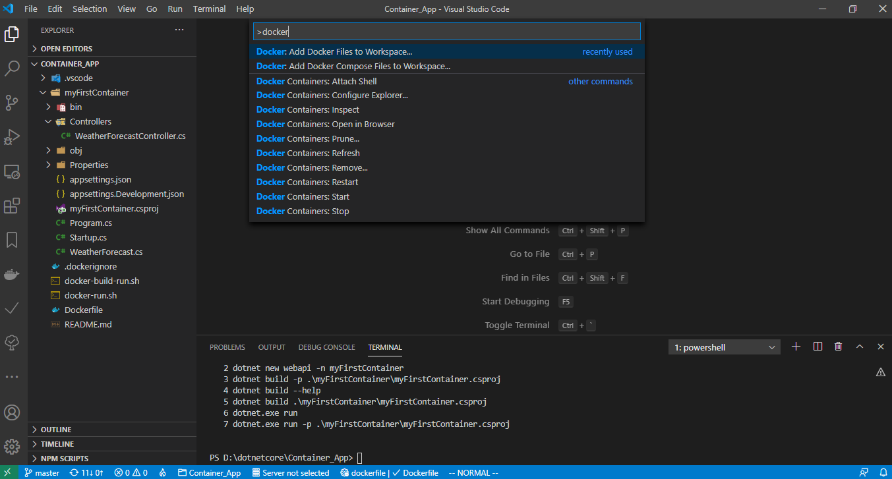
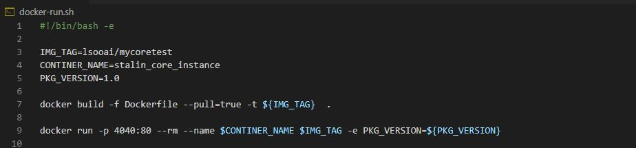

# Execute the bellow steps in a terminal

#### Table of Contents

*   [Project Creation and Build](#Create_Code)
*   [Script](#Create_script)
*   [Troubleshoot](#Troubleshoot)
*   [Validate Container](#Validate)
*   [Debug Container](#debug)
*   [Cleanup](#remove)
*   [push_docker_hub](#push_docker_hub)
*   [Kubernetees-Minikube](Kubernetees-Minikube.md)


## Create_Code
### create web api project - scaffold

```bash
$ dotnet new webapi -n myFirstContainer
$ dotnet build -p .\myFirstContainer\myFirstContainer.csproj
$ dotnet.exe run -p .\myFirstContainer\myFirstContainer.csproj
```

### Create docker file and dockerignore file - scaffold
VScode-> Command Pallet (Shift+ Ctrl +P) -> docker file to workspace



## Create_script



```bash
$ ./docker-run.sh
```

## Troubleshoot

*bash: ./docker-run.sh: /bin/bash^M: bad interpreter: No such file or directory* -  perform the following commands

```bash
$ sed -i -e 's/\r$//' docker-run.sh
$ sudo apt-get install dos2unix
$ dos2unix docker-run.sh
$ chmod +x docker-run.sh
```

## Validate
```bash
$ curl http://localhost:4040/WeatherForecast
```
## debug
```docker
docker exec -it stalin_core_instance sh
```
## remove local
```docker
docker stop stalin_core_instance
docker rm -f stalin_core_instance
```

## push_docker_hub
```docker
docker login --username=$DOCKER_USERNAME -p $DOCKER_PASSWORD
docker push $IMG_TAG
```
